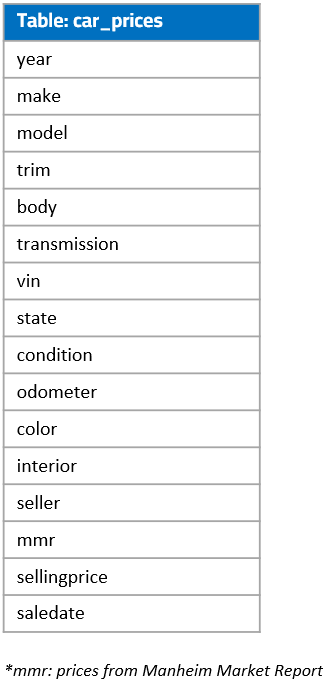

# SQL project: Vehicle Sales Data

## Project Overview
This SQL project is to analyze vehicle sales data, including sales metrics by state, by model / make. It also investigates how factors, such as condition and mileage, can affect sales.


### Business questions to be explored
1. Investigate geographical sales info: Which states have the most sales numbers? What are the average sales price for each state?
2. What are the most sold car models?
3. What’s the month-by-month sales trend?
4. For each vehicle body (i.e. sedan, SUV, hatchback, etc), what are the best selling model?
5. Is there a correlation between vehicle condition and sales price / number?
6. How does mileage affect average sales price and sales number?


### Table used for the following queries:


## Data Analysis & SQL Codes

* **Data prep / cleaning**: Use view function to store cleaned data
  - Identify invalid data (i.e. wrong state, missing make/model/sales date, etc) and exclude them from query
  - Sales dates have text type. Extract string to get sales month, year info.


```SQL
drop view car_prices_clean;
create view car_prices_clean as
select 
    *,
    substring(saledate, 12, 4) as sale_year,
    case substring(saledate, 5, 3)
        when 'Jan' then 1
        when 'Feb' then 2
        when 'Mar' then 3
        when 'Apr' then 4
        when 'May' then 5
        when 'Jun' then 6
        when 'Jul' then 7
        when 'Aug' then 8
        when 'Sep' then 9
        when 'Oct' then 10
        when 'Nov' then 11
        when 'Dec' then 12
        end as sale_month,
    substring(saledate, 9, 2) as sale_day
from car_prices
where length(state) <3 AND
    make IS NOT Null AND 
    saledate IS NOT NULL AND
    body IS NOT NULL AND
    condition IS NOT NULL AND
    odometer IS NOT NULL;
```


* **Query 1**: Find top 10 states with the most car sales.


```SQL
select
    state,
    count(*) as sales_number_by_state
from car_prices_clean
group by state
order by sales_number_by_state desc
limit 10
```


---
* **Query 2**: What are the most popular cars sold (by make, model)?

```SQL
select
    make,
    model,
    count(*) as sales_number
from car_prices_clean
group by make, model
order by sales_number desc
```


---
* **Query 3**: What are the average sales prices by state?


```SQL
select
    state,
    round(AVG(sellingprice), 0) as avg_price
from car_prices_clean
group by state
order by avg_price desc
```


* **Query 4**: Find the average sales price and sales number for each month / year.


```SQL
select
    sale_year,
    sale_month,
    round(AVG(sellingprice),0) as avg_price,
    count(*) as sales_number
from car_prices_clean
group by sale_year, sale_month
order by sale_year, sale_month
```


* **Query 5**: Find the most popular make and model for each body type (via a rank value for each body type).


```SQL
select
    make,
    model,
    body,
    sales_number,
    rank_by_body
-- use subquery to calucate rank column
from (
    select
        make,
        model,
        body,
        count(*) as sales_number,
        --use rank & partition window functions to get rank value
        cast(rank() over(partition by body order by count(*) desc) as int) as rank_by_body 
    from car_prices_clean
    group by make, model, body
) 
where rank_by_body = 1
order by sales_number desc, make, model
```


* **Query 6**: Create five tiers of car condition based on condition score, and then calculate average sales price for each tier.


```SQL
select 
    case
        when condition between 0 and 9 then 'condition tier 1'
        when condition between 10 and 19 then 'condition tier 2'
        when condition between 20 and 29 then 'condition tier 3'
        when condition between 30 and 39 then 'condition tier 4'
        when condition between 40 and 49 then 'condition tier 5'
        end as condition_tier, 
    count(*) as sales_number,
    round(avg(sellingprice), 0) as avg_price
from car_prices_clean
group by condition_tier
```


* **Query 7**: Find relationship between sales prices and mileage (use case function to create bins for mileage).


```SQL
select 
    case
        when odometer between 0 and 50000 then 'tier 1: 0 - 50k miles'
        when odometer between 50001 and 100000 then 'tier 2: 50k - 100k miles'
        when odometer between 100001 and 150000 then 'tier 3: 100k - 150k miles'
        when odometer between 150001 and 200000 then 'tier 4: 150k - 200k miles'
        when odometer > 200000 then 'tier 5: 200k miles or more'
        end as mileage_tier, 
    count(*) as sales_number,
    round(avg(sellingprice), 0) as avg_price
from car_prices_clean
group by mileage_tier
order by mileage_tier
```


---
## Date source 
[https://www.kaggle.com/datasets/syedanwarafridi/vehicle-sales-data](https://www.kaggle.com/datasets/syedanwarafridi/vehicle-sales-data)